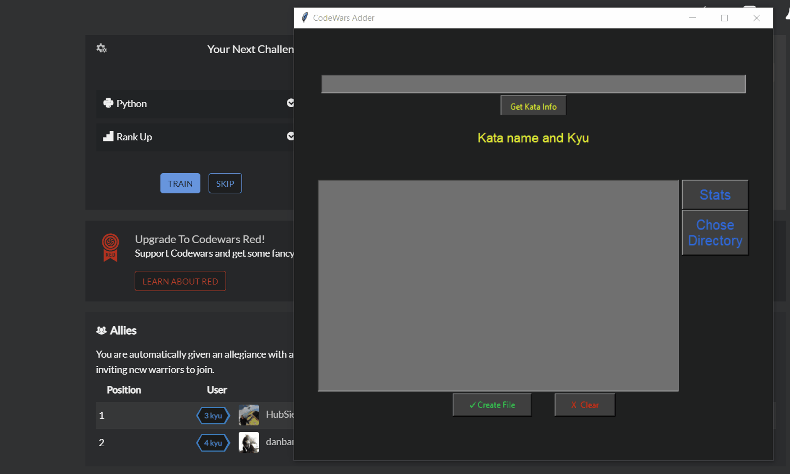

# CodeWars_Adder

I am doing [5 kata everyday challenge](https://github.com/sieczkah/Codewars_KATA), and I am saving all of my katas on my desktop(later pushing them to git). I found it really annoying to create everythin manually in the good directory, paste code, paste..... trust me it was a nightmare.

So as a little project I created this simple KataAdder/CodewarsAdder with GUI to help me with my challenge. It was a lot of fun.
Firstly it was only adding the Kata (no errors handling, nothing). Then I created messageboxes for info and errors.
Program does:
    

        
    

    

        <li>take link from user input</li>
        <li>Using provided JSON getting Kata name and Rank</li>
        <li>Creates and check filename of Kata</li>
        <li>In dir of Kata KYU creates the file - if file exists asking if to overwrite</li>
    

Right now it is super basic, I want to handle more errors, let the user choose the root dir where to create kata directories.
In the future I want it to track the challenge ( done kata, completed days, how much I need to do to keep on track)

<b>Edit:</b> I reorganized the code, and GUI itself, added msgboxes.

<b>Edit2:</b> 11.03. Realized Codewars provides info with json files, rewirted the code to use JSON instead of BeautifulSoup scrapping
Added Simple statistic (need to restyle interface and add more options to stats). Right now it only counts total Kata according to .py files in directories, need also to let main directory choice

